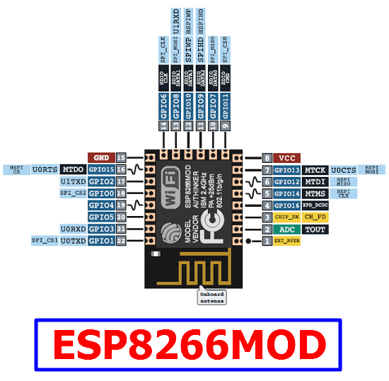
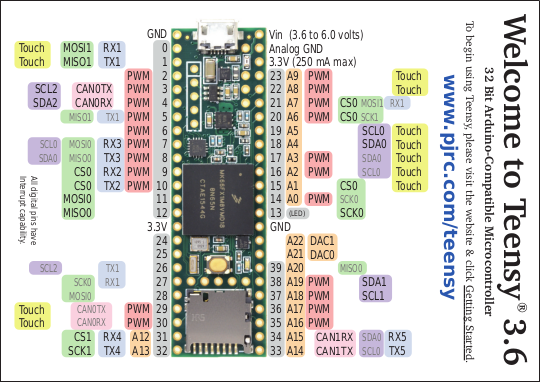

# Multi-node Arduino sistem

## 📝 Opis projekta

Primarna ideja ovog projekta je umrežavanje više Arduino kompatibilnih mikrokontrolera u povezanu strukturu (lanac). Svaki čvor u sistemu zadužen je za prikupljanje podataka sa lokalnog senzora i njihovo prosleđivanje fizičkim putem (serijskom vezom) do narednog čvora, sve dok podaci ne stignu do glavnog (**Master**) mikrokontrolera. Master čvor vrši agregaciju primljenih merenja i prosleđuje ih bežičnim putem (Wi-Fi) do centralne stanice, gde se podaci skladište i vizuelizuju.

U ovoj realizaciji, projekat je uspešno implementiran sa **dva mikrokontrolera** (Master i Slave) i **dva analogna senzora**:
*   **Master čvor (ESP8266MOD):** Prikuplja podatke sa lokalnog senzora i istovremeno asinhrono prima podatke sa Slave čvora putem UART veze. Pokreće sopstvenu Wi-Fi pristupnu tačku (Access Point) i hostuje HTTP server koji servira podatke u JSON formatu.
*   **Slave čvor (Teensy 3.6):** Očitava podatke sa svog senzora i konstantno ih strimuje ka Masteru preko serijskog porta.
*   **Klijent (Laptop):** Povezuje se na generisanu Wi-Fi mrežu, podiže lokalni Apache web server i preko klijentskog koda periodično šalje HTTP GET zahteve ka API-ju mikrokontrolera, prikazujući ažurne rezultate na interaktivnom dashboard-u unutar web pretraživača.

---

## 🛠️ Koraci za rekonstrukciju eksperimenta

### 1. Potrebni materijali

Za uspešnu rekonstrukciju ovog eksperimenta u kućnim uslovima, potrebno je obezbediti sledeći hardver:

| Kol. | Komponenta | Detalji / Napomena |
| :---: | :--- | :--- |
| 1x | **ESP8266MOD** | Master mikrokontroler sa integrisanim Wi-Fi čipom |
| 1x | **Teensy 3.6** | Slave mikrokontroler visokih performansi |
| 1x | **Protoploča (Breadboard)** | Za povezivanje komponenti |
| 1x | **Senzor pritiska** | [Tekscan FlexiForce Load/Force familija senzora](https://www.tekscan.com/flexiforce-loadforce-sensors-and-systems) |
| 1x | **Senzor savitljivosti** | [Tekscan FlexiForce Load/Force familija senzora](https://www.tekscan.com/flexiforce-loadforce-sensors-and-systems) |
| 2x | **Otpornika** | U eksperimentu su iskorišćena 2 potenciometra |
| - | **Džamper kablovi** | Muško-muški i muško-ženski provodnici |

---

### 💻 2. Programiranje mikrokontrolera

> ⚠️ **Važno:** Flešovanje koda vrši se **pre** fizičkog povezivanja pinova na protoploci kako bi se izbegli kratki spojevi ili konflikt na serijskim linijama tokom prenosa.

#### Koraci za flešovanje:
1. Povežite vaš **ESP8266MOD** modul putem USB kabla sa laptopom.
2. Pokrenite **Arduino IDE** i otvorite izvorni kod na putanji: `src/master/master.ino`.
3. Preuzmite odgovarajuće drajvere/ploče kroz *Boards Manager* i izaberite vaš ESP8266 profil i pripadajući COM port.
4. Kliknite na dugme **Upload**. Sačekajte da se proces završi, a zatim otkačite USB kabl.
5. Za programiranje **Teensy 3.6** ploče ponovite identičan postupak, ali u nju flešujte kod sa lokacije: `src/slave/slave.ino`.

---

### 🔌 3. Hardversko povezivanje

Pri realizaciji šeme koristite priložene zvanične pinout dijagrame mikrokontrolera.

#### Dijagrami pinova:

*   **ESP8266MOD Pinout:** Podaci se nalaze u `./public/assets/esp8266mod-pinout.gif`
*   **Teensy 3.6 Pinout:** Podaci se nalaze u `./public/assets/teensy3.6-pinout.png`

Nakon što ste analizirali pinove, pažljivo i precizno ispratite sledeće korake na protoploči:

1. **Glavni naponski vod:** Izvedite liniju iz ESP8266MOD **Pin 8** na protoploču u zajedničku pozitivnu šinu (**+**). Ovo predstavlja VCC napajanje od 3.3V.
2. **Glavni vod mase:** Izvedite liniju iz ESP8266MOD **Pin 15** na protoploču u zajedničku negativnu šinu (**-**). Ovo predstavlja masu (GND).
3. **Napajanje Slave čvora:** Iz zajedničke pozitivne šine (**+**) izvedite džamper žicu u Teensy 3.6 na **3.3V pin** (pozicioniran iznad Pina 23). Preko ove linije Teensy dobija stabilno napajanje.
4. **Zajednička masa:** Iz zajedničke negativne šine (**-**) izvedite žicu u Teensy 3.6 na **GND pin** (pozicioniran iznad Pina 0). *Napomena: Zajednička masa između dva mikrokontrolera je kritična za eliminaciju šuma i preciznost analognih merenja.*
5. **UART komunikaciona veza:** Povežite Teensy 3.6 **Pin 1 (TX)** direktno sa ESP8266MOD **Pin 21 (RX)**. Ovo omogućava prenos podataka sa Slave na Master čvor putem UART protokola.
6. **Senzor pritiska (Teensy):**
   * Iz zajedničke pozitivne šine (**+**) odvedite liniju na jedan kraj senzora pritiska.
   * Drugi kraj senzora postavite na slobodnu, nezavisnu liniju na protoploči.
   * Iz te zajedničke linije izvucite dve žice: jedna ide na Teensy 3.6 **Pin 14** (za analogno očitavanje), a druga ide na otpornik (potenciometar) koji je drugim krajem spojen na masu (**-**).
7. **Senzor savitljivosti (ESP8266):**
   * Iz zajedničke pozitivne šine (**+**) odvedite liniju na jedan kraj senzora savitljivosti.
   * Drugi kraj senzora postavite na drugu slobodnu liniju na protoploči.
   * Iz te linije takođe izvucite dve žice: jedna ide na ESP8266MOD **Pin 2 (ADC)** za analogno čitanje, a druga ide na drugi otpornik (potenciometar) koji je spojen na masu (**-**).
8. **Pokretanje:** Povežite ESP8266MOD sa laptopom pomoću USB kabla kako biste obezbedili napajanje za ceo sistem.

---

### 📊 4. Vizuelizacija podataka (Web Dashboard)

Poslednji korak podrazumeva prihvat podataka poslatih preko Wi-Fi mreže mikrokontrolera i njihov prikaz. 

1. **Pokretanje Apache servera:** Pokrenite lokalno web okruženje. Možete koristiti **WAMP** (za Windows) ili **XAMPP** (cross-platform). Pošto je eksperiment testiran na WAMP okruženju, koraci su prilagođeni njemu.
2. **Postavljanje klijentskih datoteka:** Navigirajte do direktorijuma `C:\wamp64\www\` na vašem računaru. Unutar njega kreirajte novi folder sa nazivom `multinode`. U novokreirani folder prekopirajte fajl `index.php` koji se nalazi u folderu `public` ovog repozitorijuma.
3. **Mrežno povezivanje:** Na vašem laptopu otvorite listu dostupnih Wi-Fi mreža i povežite se na pristupnu tačku mikrokontrolera:
   * **SSID:** `Arduino_Master_Net`
   * **Lozinka:** `123456789`
4. **Pristup dashboard-u:** Otvorite bilo koji web pretraživač i učitajte adresu na kojoj Apache server servira kreirani direktorijum. Po podrazumevanim podešavanjima, to je:
   `http://localhost:80/multinode/index.php`

> 💡 **U slučaju problema:** Ako su svi koraci ispravno ispraćeni, vrednosti na ekranu će se automatski i fluidno ažurirati u realnom vremenu. Ukoliko dashboard ne prikazuje podatke, isključite napajanje, vratite se na korak hardverskog povezivanja i detaljno proverite stabilnost džamper žica i pinova.

---

## 👥 Autori

Ovaj projekat je razvijen u akademske svrhe od strane studenata:

*   **Mateja Lapatanović** – Indeks: *67/2022*
*   **Bojan Kovarbašić** – Indeks: *63/2022*
*   **Filip Đekić** – Indeks: *52/2022*
*   **Jovana Šajkić** – Indeks: *95/2022*